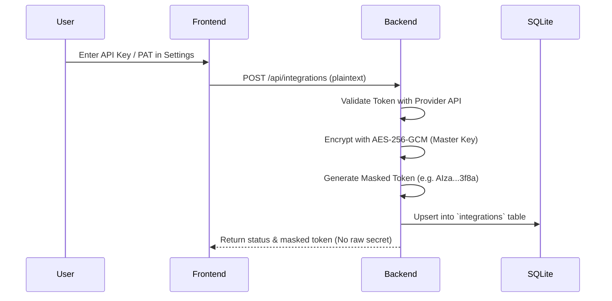
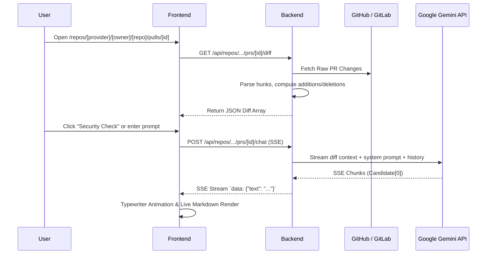

# AGENTS.md — System Architecture & Developer Guide

Welcome to the **AI Code Reviewer** codebase. This document serves as the single source of truth for AI agents and software engineers maintaining, debugging, or extending this project.

---

## 1. System Overview

**AI Code Reviewer** is an enterprise-ready, full-stack web application designed for intelligent pull request (PR) and merge request (MR) code reviews. It connects to **GitHub** and **GitLab** (including self-hosted instances), fetches multi-file unified and split git diffs, interacts in real-time with **Google Gemini models** over Server-Sent Events (SSE), and allows developers to publish structured senior-level reviews back to the remote git provider.

### Core Architectural Values
1. **Security-First Secret Management**: API keys (Gemini) and Personal Access Tokens (PATs) are encrypted at rest using **AES-256-GCM** with a master server key. Plaintext secrets never leave the server; only masked previews are transmitted to clients.
2. **Unified Provider Abstraction**: A single Go interface (`GitProvider`) normalizes GitHub and GitLab APIs (merge requests, file diffs, project resolution, note creation).
3. **Fluid Streaming & Typewriter UX**: Server-Sent Events (SSE) deliver incremental model tokens to a client-side typewriter engine with real-time markdown parsing, syntax highlighting, and an instant "Thinking & Analyzing" diagnostic stage.

---

## 2. Directory Layout & Key Modules

```
code_reviewer/
├── AGENTS.md                     # AI Agent & Architecture Guidelines (This file)
├── README.md                     # User-facing setup & usage guide
├── docker-compose.yml            # Multi-service production stack
├── .env.example                  # Environment variable reference
│
├── backend/                      # Go Backend Service (Chi + SQLite + AES-GCM)
│   ├── cmd/server/main.go        # Server entry point & graceful shutdown
│   ├── internal/
│   │   ├── config/config.go      # Environment variable loader
│   │   ├── crypto/
│   │   │   ├── crypto.go         # AES-256-GCM Encrypt/Decrypt + Token masking
│   │   │   └── crypto_test.go    # Encryption & masking unit tests
│   │   ├── database/
│   │   │   ├── db.go             # SQLite schema, connection & query methods
│   │   │   ├── models.go         # Integration, Repository, ChatMessage structs
│   │   │   └── db_test.go        # In-memory SQLite CRUD & migration tests
│   │   ├── handlers/
│   │   │   ├── handlers.go       # HTTP handlers (Integrations, Repos, Diff, SSE Chat)
│   │   │   └── handlers_test.go  # End-to-end HTTP route tests
│   │   ├── providers/
│   │   │   ├── provider.go       # GitProvider interface definition
│   │   │   ├── github.go         # GitHub REST API client
│   │   │   ├── github_test.go    # GitHub mock unit tests
│   │   │   ├── gitlab.go         # GitLab REST API client & project identifier resolver
│   │   │   ├── gitlab_test.go    # GitLab mock server & resolution tests
│   │   │   ├── gemini.go         # Gemini SSE stream client & fallback engine
│   │   │   └── gemini_test.go    # Gemini candidate parsing & error tests
│   │   └── router/
│   │       └── router.go         # Chi router configuration & CORS middleware
│   ├── go.mod / go.sum           # Go dependencies
│   └── Dockerfile                # Multi-stage alpine Go build
│
└── frontend/                     # Next.js 14 App Router (React 18 + Tailwind)
    ├── src/
    │   ├── app/
    │   │   ├── layout.tsx        # Root layout with ThemeProvider, ToastProvider & Navbar
    │   │   ├── page.tsx          # Main landing dashboard
    │   │   ├── globals.css       # Tailwind CSS base styles & dark/light theme variables
    │   │   ├── repos/
    │   │   │   ├── page.tsx      # Repository directory & manual add modal
    │   │   │   └── [provider]/[owner]/[repo]/
    │   │   │       ├── page.tsx  # PR/MR list page with status filters
    │   │   │       └── pulls/[pullNumber]/
    │   │   │           └── page.tsx # 3-column PR Review Studio (Tree + Diff + AI Chat)
    │   │   └── settings/page.tsx # Integration management (Gemini, GitHub, GitLab)
    │   ├── components/
    │   │   ├── chat/             # AI Chat Panel, Typewriter Engine, Quick Actions, Markdown
    │   │   ├── diff/             # Unified/Split Diff Viewer & File Tree Navigation
    │   │   ├── navbar.tsx        # Top navigation header & theme toggle
    │   │   ├── theme-provider.tsx# Dark/Light/System theme context
    │   │   └── ui/               # Reusable primitive components (Button, Card, Dialog, Toast)
    │   └── lib/
    │       ├── api.ts            # Typed REST & SSE streaming fetch client
    │       ├── types.ts          # TypeScript interfaces (Integration, Repository, PullRequest)
    │       └── utils.ts          # Class merging (cn) & humanized date formatters
    ├── package.json              # NPM dependencies & scripts
    └── Dockerfile                # Multi-stage node Alpine build
```

---

## 3. Core Data Flow & Pipelines

### A. Authentication & Secret Encryption Flow


### B. Pull Request Diff & Review Studio Flow


---

## 4. Key Implementation Rules for Agents

### Rule 1: Secret Storage & Crypto
- **Never store plaintext secrets** in the database or log files.
- Always use `crypto.Encrypt(plaintext, masterKey)` before saving tokens.
- Always return `crypto.MaskToken(token)` in API responses to prevent frontend exposure.

### Rule 2: Git Provider Resolution (`ResolveProjectIdentifier`)
- GitLab projects can be referenced by numeric ID (`77458911`), slug name (`loyalty-program`), or display name (`Loyalty Program`).
- When making GitLab API calls, use `g.ResolveProjectIdentifier(ctx, token, baseURL, owner, name)` to ensure proper routing.
- URL-encoded paths must use RFC 3986 path escaping (`url.PathEscape`) rather than query escaping (`url.QueryEscape`).

### Rule 3: Gemini Token Streaming & Candidate Parsing
- The Gemini streaming endpoint returns chunk payloads in SSE format (`data: {"candidates": [...]}`).
- **Strictly process only the primary candidate (`chunk.Candidates[0]`)**. Iterating over all candidates will cause duplicated response blocks.
- Prepend the diff context as the initial context turn to ground Gemini's review in the active code changes.

### Rule 4: Frontend Layout & Scroll Management
- The root layout (`frontend/src/app/layout.tsx`) wraps all views in `<ThemeProvider>`, `<ToastProvider>`, `<Navbar>`, and `<main className="flex-1 overflow-hidden flex flex-col min-h-0 w-full">{children}</main>`.
- Internal scroll containers must use `min-h-0` and `overflow-y-auto` to prevent outer window scrolling issues in full-viewport layouts.

---

## 5. Development & Testing Commands

### Backend Tests
```bash
cd backend

# Run all backend tests
go test -v -count=1 ./...

# Run specific package tests
go test -v -count=1 ./internal/providers
go test -v -count=1 ./internal/database
go test -v -count=1 ./internal/handlers
go test -v -count=1 ./internal/crypto

# Static analysis and verification
go vet ./...
```

### Frontend Tests & Builds
```bash
cd frontend

# Run unit tests
npm test

# Production build test
npm run build

### Pre-Commit Security & Health Scan
```bash
# Run security and secret scanner across codebase
./scripts/scan.sh
# or from frontend:
npm run scan
```

### Docker Multi-Service Deployment
```bash
# Build and run containers in background
docker compose up -d --build

# View real-time container logs
docker logs -f code-reviewer-backend
docker logs -f code-reviewer-frontend

# Stop services
docker compose down
```

---

## 6. Extending the System

### Adding a New Git Provider (e.g., Bitbucket)
1. Implement the `GitProvider` interface in `backend/internal/providers/bitbucket.go`:
   - `Name() string`
   - `TestConnection(ctx, token, baseURL) error`
   - `ListRepositories(ctx, token, baseURL) ([]database.Repository, error)`
   - `ListPullRequests(ctx, token, baseURL, owner, name, state) ([]database.PullRequest, error)`
   - `GetPullRequestDiff(ctx, token, baseURL, owner, name, number) ([]database.FileDiff, error)`
   - `PostComment(ctx, token, baseURL, owner, name, number, body) error`
2. Register the provider in `backend/internal/handlers/handlers.go` under `getProvider(name)`.
3. Add UI badge styling and logo in `frontend/src/components/` and `frontend/src/app/repos/page.tsx`.

### Adding a New AI Model Provider (e.g., OpenAI / Anthropic / Ollama)
1. Implement the `AIProvider` interface under `backend/internal/providers/`:
   - `Name() string`
   - `GetAvailableModels(ctx, token) ([]string, error)`
   - `StreamChat(ctx, token, model, diffCtx, history, prompt, onChunk) (string, error)`
2. Centralize default model options and pricing metadata in `backend/internal/constants/constants.go`.

### Context-Selection & Diff Pruning Principles
- Never send raw lockfiles (`package-lock.json`, `go.sum`, `yarn.lock`), minified assets, or vendor files to LLMs.
- Parse changed symbols and prioritize AST blocks with logic/control-flow modifications over purely cosmetic or whitespace diffs.
